# 项目介绍

<p align="center">
    <a href="https://yanyufanchen.gitee.io/wui-desktop" target="_blank">项目演示</a> |
    <a href="https://uniapp.dcloud.io/README" target="_blank">uniapp官方文档</a>  |
    <a href="https://uniapp.dcloud.io/uniCloud/README" target="_blank">uniCloud官方文档</a> 
</p>

<p align="center">
    
    
    
    
</p>
- 
   YUI云桌面系统，前端使用Vue2.x + Element UI，目前支持PC端，后台服务支撑采用uniCloud(基于Nodejs,云数据库、云函数、云存储)，代码托管在gitee并使用Pages做页面展示。
- 
   在这里感谢平台提供的阿里云服务，目前个人使用并不收费，彻底摆脱了私有化服务器的运维成本。
- 
   并配合gitee的pages服务，无需域名和服务器便可实现全栈项目的部署和迭代更新。

- 
   如果觉着还不错的话，就请点个 ⭐star 支持一下吧，这将是对我最大的支持和鼓励！


## 内置功能

1.  登录板块
  <table>
    <tr>
        <td>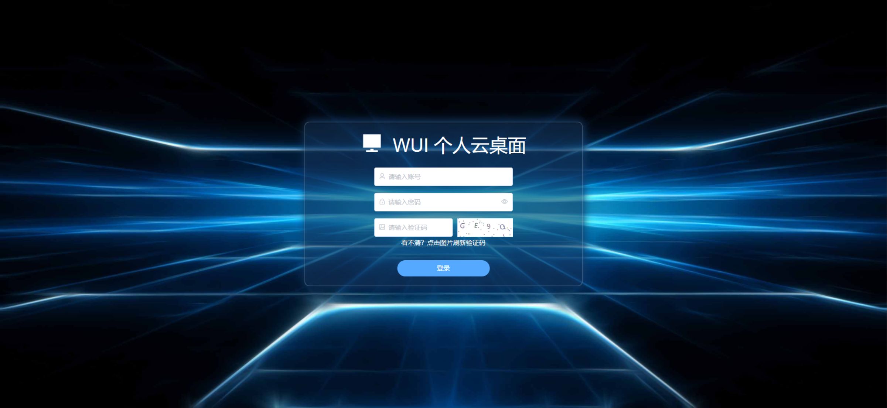</td>
        <td>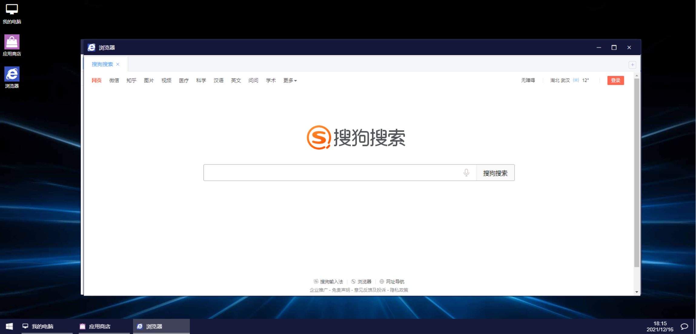</td>
    </tr>
  </table>

2.  桌面板块
  <table>
    <tr>
        <td>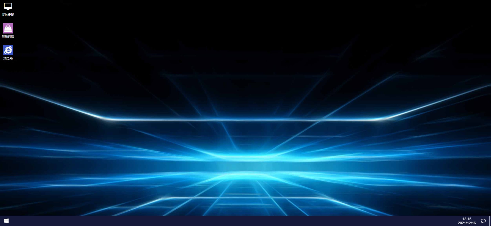</td>
        <td>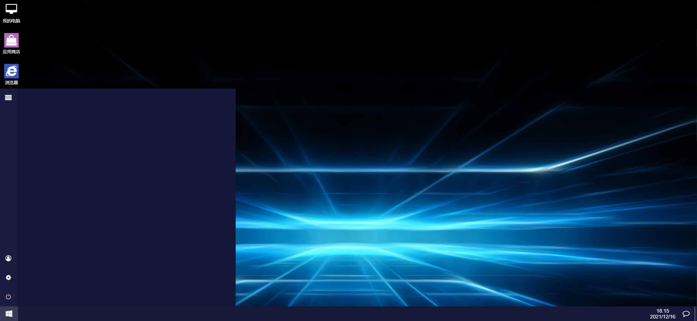</td>
    </tr>
  <tr>
      <td>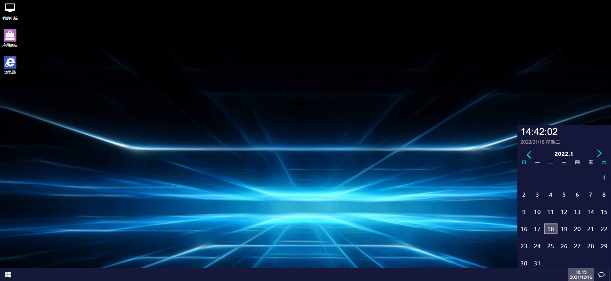</td>
      <td></td>
  </tr>
  </table>

3.  我的电脑、是一个在线资源管理器，可存储多种格式资源，并提供在线预览功能
  <table>
    <tr>
        <td>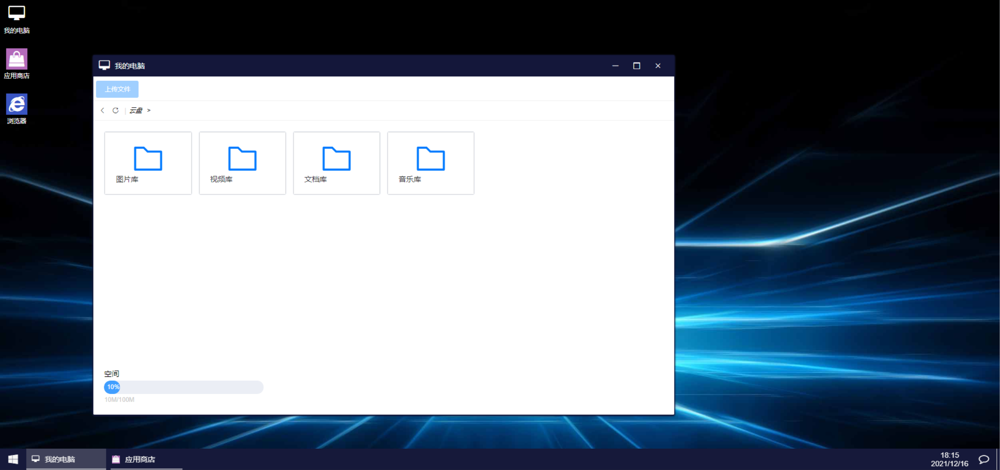</td>
        <td>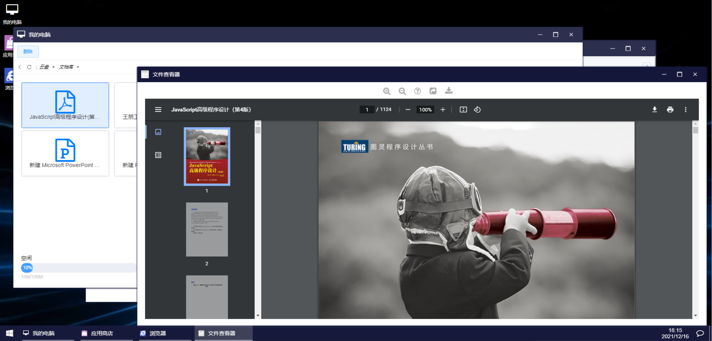</td>
    </tr>
  </table>

4.  浏览器、提供常规网页搜索功能
  <table>
    <tr>
        <td></td>
        <td>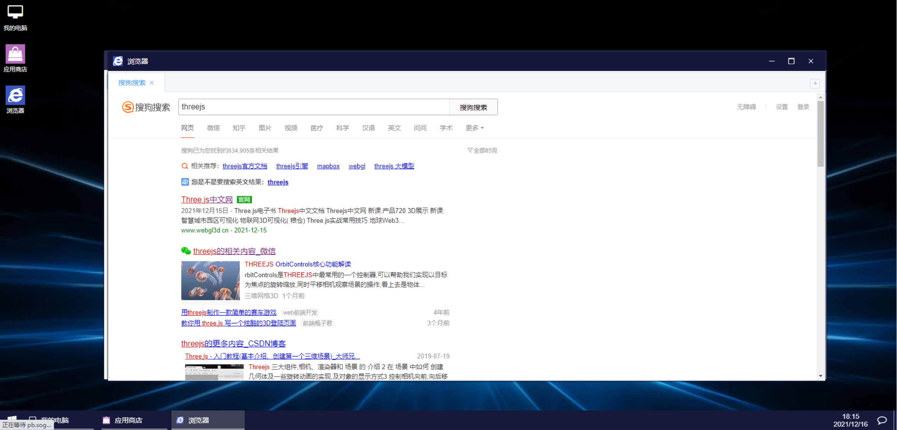</td>
    </tr>
  </table>

5. 应用商店、是系统继承的应用管理，可以提供用户安装应用和卸载，后期会持续更新和扩展应用，这也是该云桌面系统的核心功能

   <table>
   <tr>
   <td>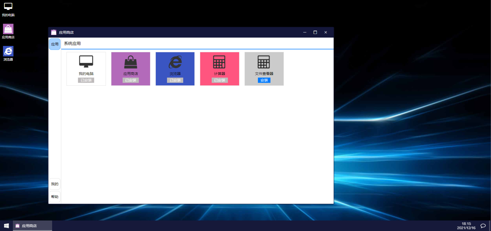</td>
   <td>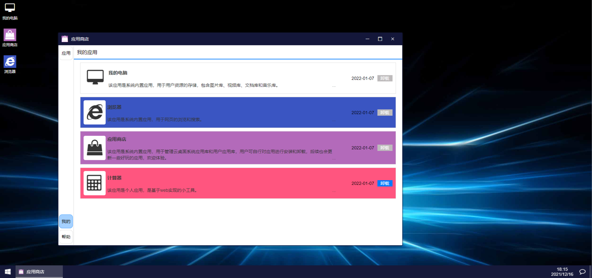</td>
   </tr>
   </table>

6. 系统设置、提供云桌面配置的设置，如壁纸上传更换，用户信息设置等。

   <table>
   <tr>
   <td>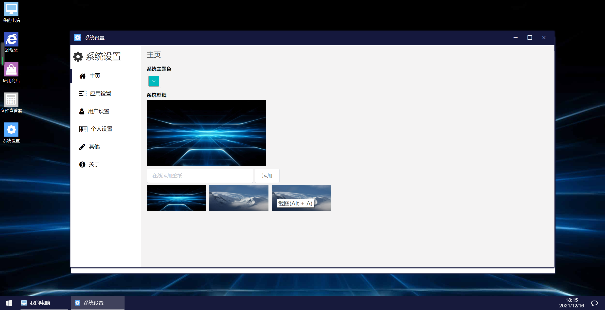</td>
   <td>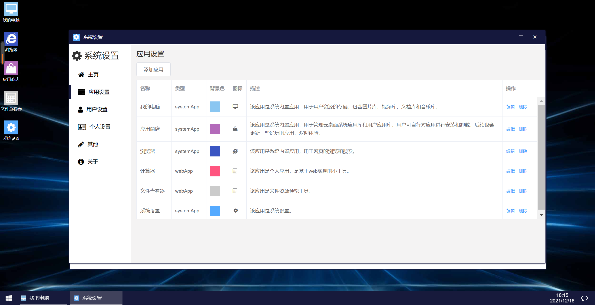</td>
   <td>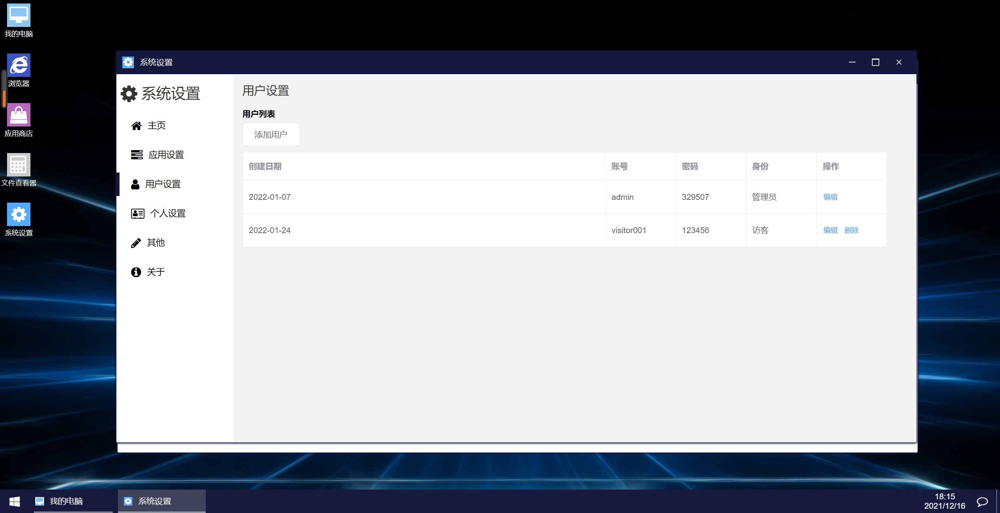</td>
   </tr>
   <tr>
   <td>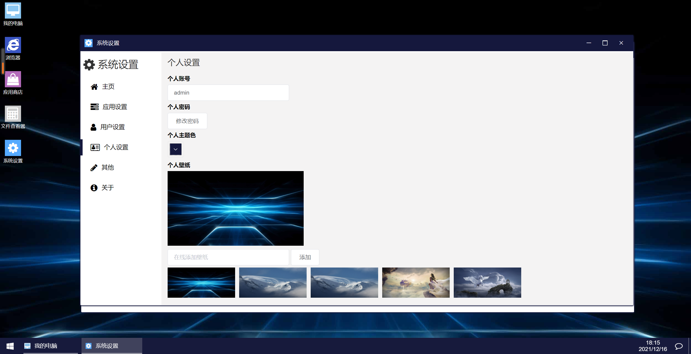</td>
   <td></td>
   <td></td>
   </tr>
   </table>

## 环境需求

- HBuilderX 3.X uniapp开发编辑器
- uniCloud账号


## 下载项目
```shell
git clone https://gitee.com/yanyufanchen/wui-desktop.git && cd wui-desktop
npm install
```

## 后端安装
uniCloud-aliyun文件夹极为云服务的本地文件

1、关联云服务空间

</table>

<tr>
<td>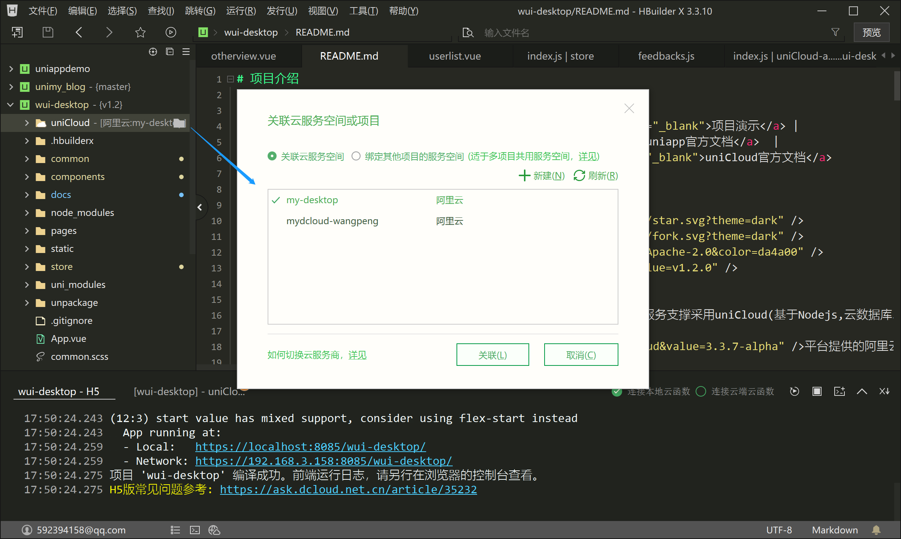</td>
</tr>

</table>

2、初始化云函数

<table>
<tr>
<td>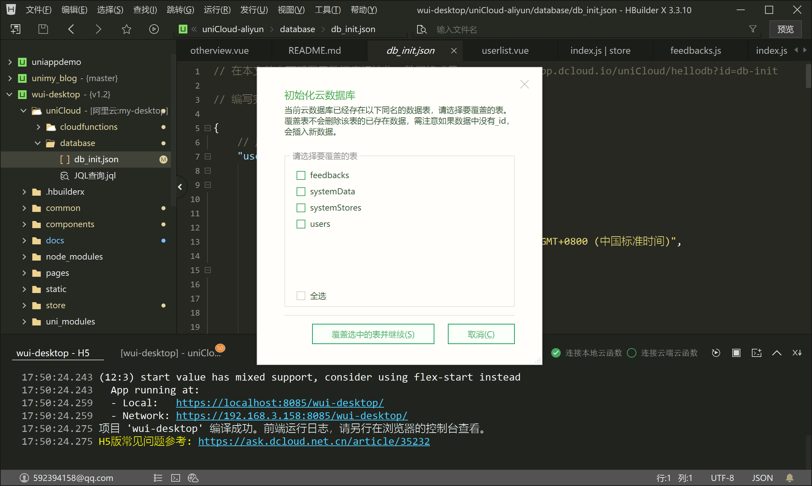</td>
</tr>
</table>

## 启动

使用编辑器的运行按钮启动项目

## 体验地址

[体验地址](https://yanyufanchen.gitee.io/wui-desktop/)

- 账号：test01
- 密码：123456

> 请勿添加脏数据

## 开发功能点
### v1.2.0-2022.01.31
```
桌面
【更新】完成桌面基础功能搭建
【更新】增加锁屏功能
【更新】增加退出登录功能
我的电脑
【更新】完成资源管理功能(包括文件预览功能)
浏览器
【更新】完成基础搜索引擎搭建
应用商店
【更新】完成系统应用展示
【更新】完成我的应用展示
系统设置和用户设置
【更新】系统设置组件开发
	系统壁纸，主题色可视化配置，
	针对管理员的功能板块，如系统应用创建
【更新】用户设置组件归属于系统设置
【更新】用户设置组件开发
【更新】针对管理员的功能板块
 	应用设置、用户设置
【更新】个人设置-个人密码、主题色、壁纸等设置
【更新】其他-意见反馈板块
【更新】关于-系统参数
【修复】时间栏组件优化
```
### v1.3.0-2022.06.15
```
登录界面
【更新】增加基于百度AI的人脸登录功能
我的电脑
【更新】增加word文档预览功能
浏览器
【更新】将浏览器数据同步到数据库
其他
【优化】重新调整数据格式处理
```
### 近期开发任务
```
1.网页导航
2.计算器
3.word部分报错排查
4.mackdown文档查看实现
5.3d模型上传查看，格式转换实现
6.调整资源管理器样式
7.底部栏icon简化
8.软件更新处理
```

## QQ群

> 

## 鸣谢

> 以下排名不分先后

[DCloud uniapp的开发平台](https://www.dcloud.io/)

[uniapp 前端跨平台解决方案](https://uniapp.dcloud.io/)

[uniCloud 为开发者提供的云服务平台](https://uniapp.dcloud.net.cn/uniCloud/README)

[Element ui前端UI框架](https://element.eleme.cn/#/zh-CN/guide/design)

